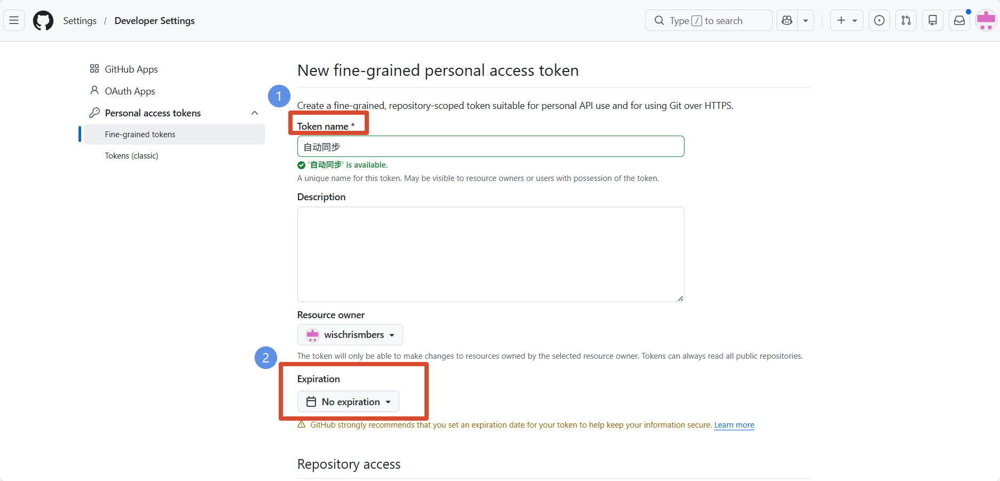
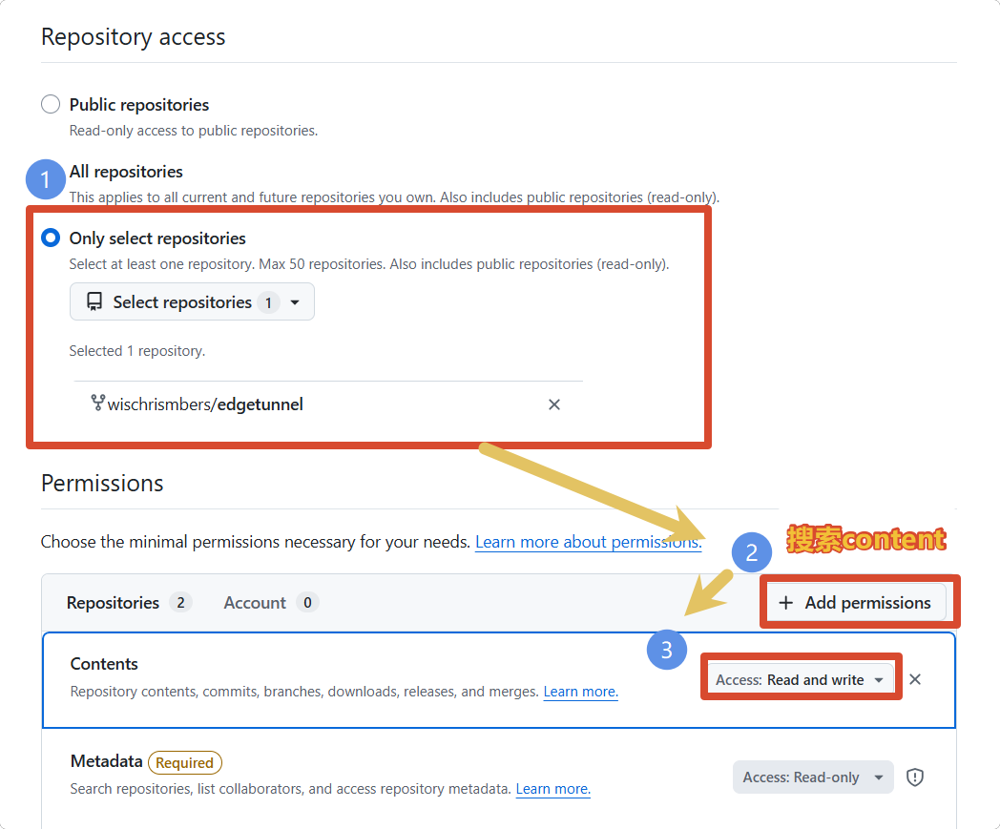
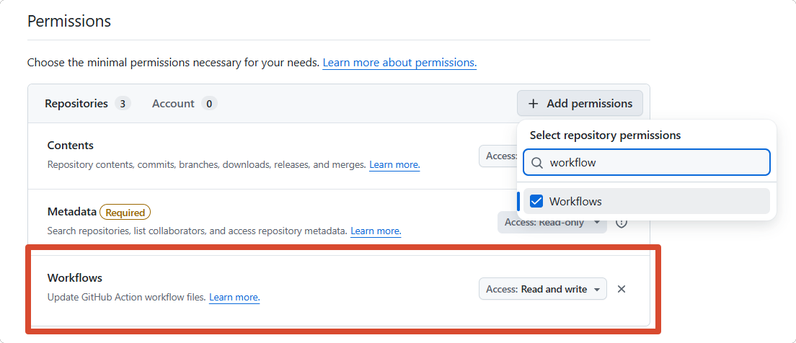
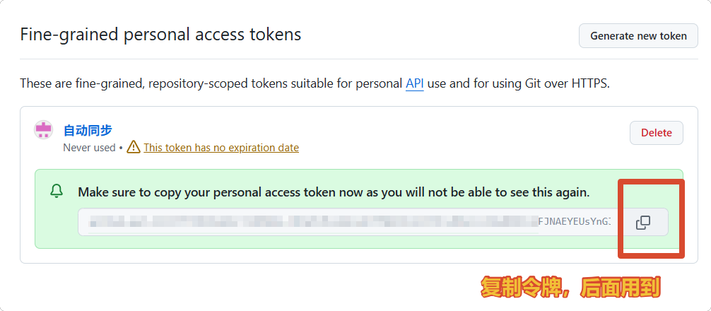
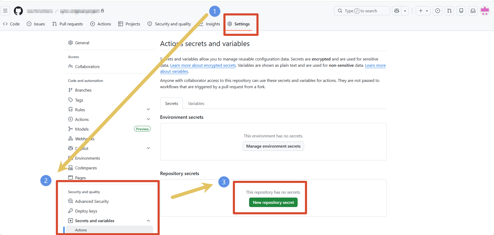
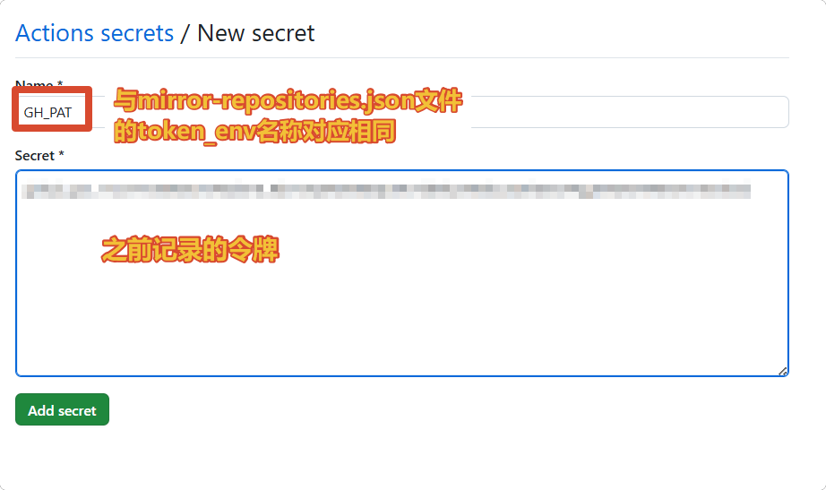
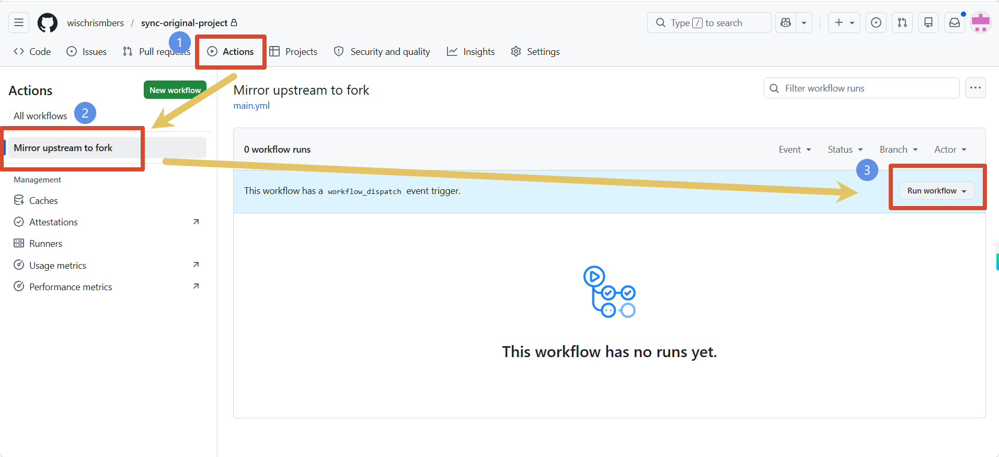
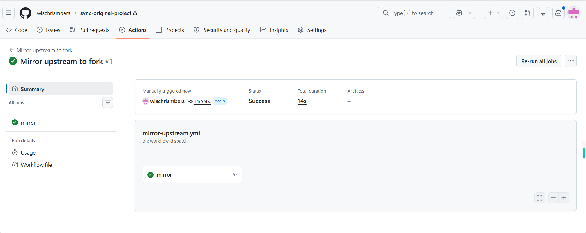

# sync-original-project

这个仓库通过 GitHub Actions 定时把多个上游仓库镜像同步到目标仓库。同步使用 `git clone --mirror` 和 `git push --mirror`，会同步分支、标签等 Git 引用。

默认每 3 天自动同步一次，也可以在 GitHub Actions 页面手动触发。

## 安全原则

不要把令牌写进仓库文件。`.github/mirror-repositories.json` 只配置令牌对应的环境变量名，真正的令牌值放在 GitHub Actions Secrets 中。

建议把自己的同步配置仓库设为私有仓库。配置文件里虽然不保存 Token 明文，但会暴露你要同步的上游仓库、目标仓库、Secret 环境变量名和 Actions 运行日志。

## 使用教程

### 1. 准备自己的同步配置仓库

先基于本仓库创建一份你自己的同步配置仓库，并建议设置为私有仓库。

需要注意：GitHub 的 fork 会共享上游仓库的可见性设置。如果本仓库是公开仓库，直接 Fork 出来的仓库通常也是公开的，不一定能直接改成私有仓库。更稳妥的做法是：

1. 在 GitHub 上新建一个私有仓库，例如 `sync-original-project-private`。
2. 把本仓库代码复制或推送到这个私有仓库。
3. 后续所有 Token、Actions Secret 和同步配置都只在你的私有仓库里维护。

这样做可以避免把你的同步目标、运行日志和配置变更公开给所有人。

### 2. 准备目标仓库

先在 GitHub 上创建用于接收镜像的目标仓库。目标仓库建议专门用于同步，不要在里面直接开发，因为镜像推送会覆盖目标仓库的 Git 引用。

例如：

- 上游仓库：`https://github.com/cmliu/edgetunnel.git`
- 目标仓库：`wischrismbers/edgetunnel`

### 3. 创建 GitHub Token

创建一个有目标仓库写入权限的 GitHub Personal Access Token。

Token 权限建议按最小权限配置：

- 推荐使用 Fine-grained personal access token。
- `Repository access` 选择 `Only select repositories`，只勾选要接收镜像的目标仓库，例如 `wischrismbers/edgetunnel`。
- `Permissions` 里添加 `Contents: Read and write`和`Workerflows`。
  其中`Metadata: Read` 通常会自动包含。









注意：

不要选择 `Public repositories`，这个选项只提供公开仓库的只读访问，不能用于 `git push --mirror`。也不建议选择 `All repositories`，除非你明确需要同一个 Token 同步很多目标仓库；它会给当前和未来仓库更大的访问范围。

如果运行日志里出现 `The requested URL returned error: 403`，通常就是 Token 没有目标仓库写入权限、没有选中目标仓库，或者目标仓库规则拒绝了镜像推送。

### 4. 添加 Actions Secret

在当前同步配置仓库中进入：

`Settings` -> `Secrets and variables` -> `Actions` -> `New repository secret`



新增 Secret，例如：

```text
Name: GH_PAT
Secret: 你的 GitHub Token
```



如果不同目标仓库要使用不同 Token，可以创建多个 Secret，例如 `GH_PAT_PROJECT_A`、`GH_PAT_PROJECT_B`。

### 6. 配置同步仓库

仓库同步关系写在 `.github/mirror-repositories.json`：

```json
[
  {
    "name": "edgetunnel",
    "upstream": "https://github.com/cmliu/edgetunnel.git",
    "target": "wischrismbers/edgetunnel",
    "token_env": "GH_PAT"
  }
]
```

字段说明：

- `name`：日志中显示的同步名称。
- `upstream`：上游仓库 clone URL。
- `target`：目标仓库，格式为 `owner/repo`。
- `token_env`：workflow 中暴露给脚本的 token 环境变量名。
- `enabled`：可选。设置为 `false` 时跳过该仓库。

新增仓库时，在数组中追加一项：

```json
{
  "name": "project-a",
  "upstream": "https://github.com/upstream-owner/project-a.git",
  "target": "your-owner/project-a",
  "token_env": "GH_PAT_PROJECT_A"
}
```

### 7. 映射 Token 环境变量

如果配置文件使用了新的 `token_env`：

```json
"token_env": "GH_PAT_PROJECT_A"
```

除了创建同名 GitHub Actions Secret，还需要在 `.github/workflows/mirror-upstream.yml` 的 `env` 中显式映射：

```yaml
env:
  GH_PAT: ${{ secrets.GH_PAT }}
  GH_PAT_PROJECT_A: ${{ secrets.GH_PAT_PROJECT_A }}
```

这样做的好处是：配置文件可以公开提交，令牌值不会进入 Git 历史。

### 8. 手动运行一次

提交配置后，进入 GitHub 仓库的 `Actions` 页面，选择 `Mirror upstream to fork`，点击 `Run workflow`。第一次建议手动运行，确认日志中每个仓库都同步成功。



成功结果如下图：



## 定时同步

Workflow 默认每 3 天运行一次：

```yaml
schedule:
  - cron: "17 0 */3 * *"
```

GitHub Actions 的 `schedule` 使用 UTC 时间。上面的配置表示 UTC 时间每 3 天的 00:17 左右运行一次。

如果想改频率，编辑 `.github/workflows/mirror-upstream.yml` 里的 cron 表达式即可。

## 同步流程与 Cloudflare 触发

脚本的同步流程是：

1. 读取 `.github/mirror-repositories.json`。
2. 对每个启用的仓库执行 `git clone --mirror`，克隆上游仓库的 Git 引用。
3. 删除本地 clone 中的 `refs/pull/*`，避免 GitHub 拒绝更新 hidden refs。
4. 执行 `git push --mirror`，把目标仓库的分支、标签等引用更新成和上游一致。
5. 最后输出 `x/y succeeded` 和失败明细。

脚本不会额外生成新的 commit。上游有新提交时，目标仓库对应分支会被推送到这个上游提交；如果 Cloudflare Pages 连接的是目标仓库和对应分支，这次 Git push 通常会触发 Cloudflare 自动部署。

如果上游没有变化，`git push --mirror` 通常会显示已经是最新状态，不会产生新的目标分支更新，也就不会触发新的 Cloudflare 部署。不要为了每次定时任务都强制触发 Cloudflare 而额外创建空 commit，否则目标仓库就不再是上游的纯镜像。

## 失败处理

多仓库同步时，某一个仓库同步失败不会影响后续仓库继续同步。Workflow 会继续处理配置文件里的其他仓库，并在日志最后输出成功和失败数量、失败仓库名称和失败原因。

常见失败原因：

- `token_env` 对应的 GitHub Actions Secret 未配置。
- workflow 的 `env` 中没有显式映射该 Secret。
- 目标仓库不存在或 Token 没有写入权限。
- 上游仓库地址不可访问。
- 目标仓库启用了分支保护，拒绝镜像推送。
- 如果完整日志中出现 `deny updating a hidden ref`，说明上游 clone 下来了 GitHub 的 `refs/pull/*` 引用。脚本会在推送前自动删除这些本地 pull request refs，再执行镜像推送。

## 风险和注意

- `git push --mirror` 会让目标仓库的引用与上游仓库保持一致，目标仓库中只存在于目标侧的分支或标签可能会被删除。目标仓库建议专门用于镜像同步，不要在目标仓库直接开发。
- 同步配置仓库如果是公开仓库，任何人都能看到 `.github/mirror-repositories.json`、workflow 文件和 Actions 日志。Token 值不会直接出现在配置文件里，但同步关系、目标仓库和失败原因会暴露。
- 不要把 Token 写进 README、JSON、YAML、提交记录或 issue/comment。即使后续删除，Git 历史里也可能还能找到。
- Token 权限建议最小化，只给需要同步的目标仓库写入权限。不要使用权限过大的长期 Token。
- 私有仓库运行 GitHub-hosted Actions 会消耗账号或组织的免费分钟额度；仓库很多或上游仓库很大时，同步时间会增加。
- 如果目标仓库有分支保护、规则集、强制签名等限制，`git push --mirror` 可能失败。镜像仓库通常不建议开启会阻止镜像推送的规则。
- 如果上游仓库删除了分支或标签，下一次镜像同步也会把目标仓库对应的引用删除。
